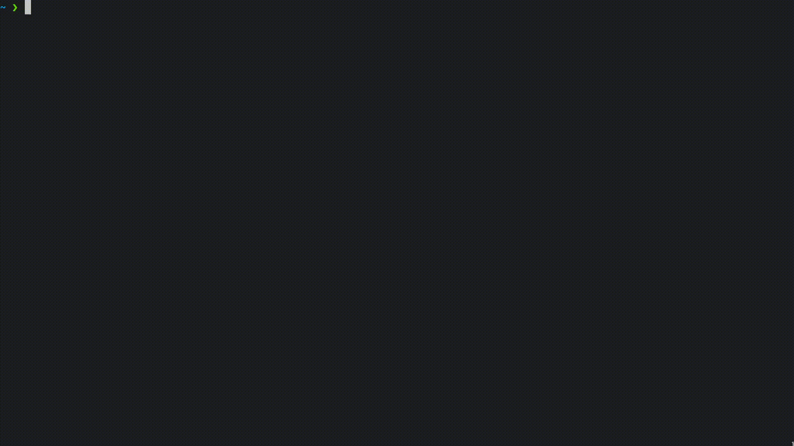
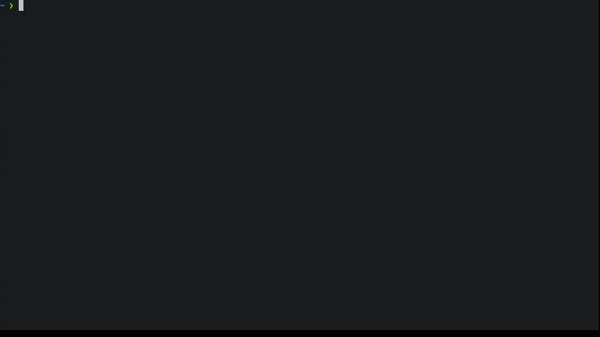

# seccomp-pledge

## Introduction

In a nutshell, `seccomp-pledge` is a systems hardening tool that marries `seccomp-bpf` to `pledge` and `unveil`.

For reference, `seccomp-bpf` is a feature in the Linux kernel that allows specifying filters for system calls spawned by processes in the form of Berkeley Packet Filter (BPF) programs. A configurable set of policies (Allow, Errno, Trap, etc.) determines the kind of filtering that will be applied to system calls intercepted by `seccomp`. This minimizes the attack surface of the kernel that is exposed to userland applications.

`pledge` is a sandboxing mechanism implemented in OpenBSD that restricts the operational capabilities of processes by defining a set of promises that determine the system calls which will be made unavailable to the respective process. It has been ported to Linux as a standalone binary by Justine Tunney. Find more information about `pledge` [here](https://justine.lol/pledge).

`unveil` is another OpenBSD sandboxing mechanism that is used to provide path permissions to processes. By default, a `pledge` sandbox will restrict access to the entire filesystem. It is possible to allow a process access to some path using `unveil` if required. The type of permissions granted (read-only, read-write, etc.) can also be specified. Justine Tunney's `pledge` port incorporates support for `unveil`.

This tool upholds the principle of the least privilege (PoLP) and limits processes to exactly what they are designed for, disallowng any non-essential operations as desired. It will cause core dumps if the user blocks a syscall that is fundamental to the execution of the process, which implies that the `seccomp` filters need to be constructed with care and `pledge` promises must be chosen appropriately.

A detailed list of syscalls with an explanation of the parameters can be found [here](https://linuxhint.com/list_of_linux_syscalls/).

## Supported platforms

Since `seccomp` is Linux-specific, syscall filtering using this feature is supported only on Linux systems. Non-Linux systems will have to proceed without `seccomp-bpf` filters.

## Features

- Accept the process to be executed (with optional flags) as an argument
- Perform optional dependency checking
- Display the list of syscalls (name and arguments) spawned by the process using `lurk`
- Use `seccompiler` as a high-level interface for defining `seccomp-bpf` filters
- Serialize the syscall list and filter list into JSON objects using `serde` and save at current path for later reference
- Install user-defined filters as BPF programs for current and child processes
- Support for running in three modes: interactively, non-interactively by directly supplying all necessary arguments during execution and via a Unix IPC socket as an API layer for communication
- Optionally fetch Justine Tunney's Linux port of `pledge` from upstream or use the local version to wrap around command invocations
- Provide intuitive prompts to simplify the process of constructing `seccomp` filters and selecting `pledge` promises and `unveil` path permissions

## Dependencies

`seccomp-pledge` has the following dependencies:

- [seccompiler](https://github.com/rust-vmm/seccompiler) - Provides easy-to-use Linux `seccomp-bpf` jailing
- [lurk](https://github.com/JakWai01/lurk) - A pretty (simple) alternative to `strace`
- [pledge](https://justine.lol/pledge) - Linux port of OpenBSD's `pledge(2)`
- [serde](https://serde.rs) - Framework for (de)serializing data structures in Rust
- [wget](https://www.gnu.org/software/wget/) - Retrieve files from the web using HTTP(S)
- [optional-field](https://github.com/cvpartner/optional-field) - Provides a Rust type for values that can be missing/null

## Installation

To run `seccomp-pledge`, ensure `cargo` is installed on your system and follow these steps:

```sh
git clone https://github.com/DeviousCilantro/seccomp-pledge.git
cd seccomp-pledge
cargo build --release
./target/release/seccomp-pledge [FLAGS] [COMMAND]
```
## Usage
Here is a  quick overview of `seccomp-pledge`:
```sh
USAGE:
    <path to seccomp-pledge binary> [--check | --no-check] [--local | --remote] [--api | --no-api] [COMMAND]...
    
ARGS:
    <command>... Sandbox command

FLAGS:
    --check
        Proceed with dependency checking
    --no-check
        Continue without dependency checking
    --local
        Use the local pledge binary supplied
    --remote
        Fetch remote pledge binary from upstream using wget
    --api
        Communicate via Unix socket API
    --no-api
        Disable Unix socket API
    -v [PERMS]:PATH
        Unveil path. Defaults to read-only operations
    -p  PROMISES
        Specify the pledge promises to be granted to the process. Defaults to 'stdio rpath'
```

When the `-v` and `-p` flags are supplied, `seccomp-pledge` will run in non-interactive mode, assuming all the necessary arguments have been provided during execution. This skips `seccomp` filtering.
When the `--api` flag is supplied, `seccomp-pledge` will run in API mode, creating a Unix socket at `/tmp/seccomp-pledge.sock` which can then be used for communication using, for instance,  the Linux port of OpenBSD's `netcat` [`nc -U /tmp/seccomp-pledge.sock`].
Otherwise, it runs in standard interactive mode, guiding the user through the different stages of creating the `seccomp` filtering policy and defining the `pledge` sandbox.

## Demonstrations

This is a series of demonstrations on the three modes of using `seccomp-pledge` for sandboxing, for instance, `ls`. The `pledge` promises supplied are `stdio`, `rpath`, and `tty` and the current directory is unveiled with the default read-only permissions. `seccomp` filtering is disabled for the non-interactive mode.

Non-interactive mode:



Interactive mode:



API mode:

